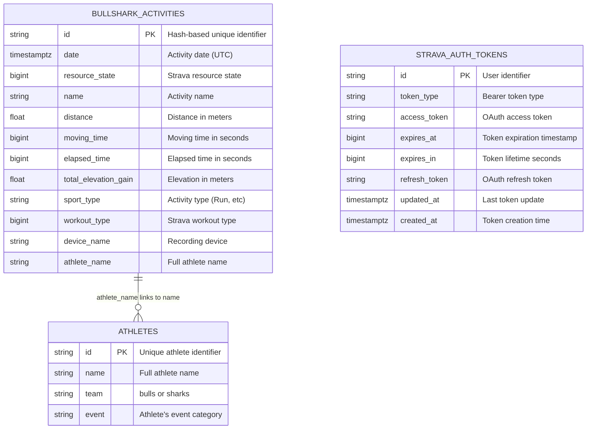

# 🗄️ Database Schema

This document describes the database structure, relationships, and data models used in BullSharks.online. The system uses PostgreSQL hosted on Supabase.

## 📊 Schema Overview



## 🏗️ Table Definitions

### `bullshark_activities` (Primary Activity Storage)

**Purpose**: Stores all activity data synced from Strava Club API

```sql
CREATE TABLE bullshark_activities (
    id VARCHAR PRIMARY KEY,                    -- Hash-based unique ID
    date TIMESTAMPTZ NOT NULL,                 -- Activity date (UTC)
    resource_state BIGINT,                     -- Strava API resource state
    name VARCHAR,                              -- Activity title
    distance DOUBLE PRECISION,                 -- Distance in meters
    moving_time BIGINT,                        -- Moving time in seconds
    elapsed_time BIGINT,                       -- Total elapsed time in seconds
    total_elevation_gain DOUBLE PRECISION,     -- Elevation gain in meters
    sport_type VARCHAR,                        -- Activity type (e.g., "Run")
    workout_type BIGINT,                       -- Strava workout classification
    device_name VARCHAR,                       -- Recording device name
    athlete_name VARCHAR                       -- Full athlete name
);
```

**Key Characteristics:**
- **Primary Key**: Hash-based ID prevents duplicates
- **Time Zone**: All timestamps stored in UTC
- **Nullable Fields**: Most fields optional to handle incomplete Strava data
- **Foreign Key**: `athlete_name` links to `athletes.name` (soft relationship)

**Indexes**:
```sql
CREATE INDEX idx_activities_date ON bullshark_activities(date);
CREATE INDEX idx_activities_athlete ON bullshark_activities(athlete_name);
CREATE INDEX idx_activities_sport_type ON bullshark_activities(sport_type);
```

### `athletes` (Team Roster)

**Purpose**: Defines team membership for Bulls vs Sharks competition

```sql
CREATE TABLE athletes (
    id VARCHAR PRIMARY KEY,                    -- Unique athlete identifier
    name VARCHAR NOT NULL,                     -- Full athlete name
    team VARCHAR NOT NULL,                     -- "bulls" or "sharks"
    event VARCHAR NOT NULL                     -- Event category
);
```

**Key Characteristics:**
- **Team Values**: Must be "bulls" or "sharks"
- **Name Matching**: Links to activities via exact name match
- **Event Categories**: Defines athlete's primary event

**Constraints**:
```sql
ALTER TABLE athletes ADD CONSTRAINT chk_team 
    CHECK (team IN ('bulls', 'sharks'));
```

### `strava_auth_tokens` (OAuth Management)

**Purpose**: Manages OAuth tokens for Strava API access

```sql
CREATE TABLE strava_auth_tokens (
    id VARCHAR PRIMARY KEY,                    -- User identifier
    token_type VARCHAR NOT NULL,               -- "Bearer"
    access_token VARCHAR NOT NULL,             -- OAuth access token
    expires_at BIGINT NOT NULL,                -- Expiration timestamp
    expires_in BIGINT NOT NULL,                -- Token lifetime in seconds
    refresh_token VARCHAR NOT NULL,            -- Refresh token
    updated_at TIMESTAMPTZ DEFAULT NOW(),      -- Last update time
    created_at TIMESTAMPTZ DEFAULT NOW()       -- Creation time
);
```

**Key Characteristics:**
- **OAuth 2.0**: Standard OAuth token storage
- **Auto-refresh**: Supports token refresh workflow
- **Timestamps**: Tracks token lifecycle

## 📈 Data Relationships

### Activity → Athlete Relationship
```
bullshark_activities.athlete_name = athletes.name
```
- **Type**: Soft foreign key (not enforced)
- **Cardinality**: Many activities to one athlete
- **Join Logic**: Used for team statistics and injury analysis

### Team Competition Logic
```sql
-- Bulls vs Sharks aggregation
SELECT 
    a.team,
    DATE_TRUNC('week', ba.date) as week_start,
    SUM(ba.distance / 1000.0) as weekly_km
FROM bullshark_activities ba
JOIN athletes a ON ba.athlete_name = a.name
WHERE ba.sport_type = 'Run'
GROUP BY a.team, week_start
ORDER BY week_start;
```

## 🔄 Data Flow Patterns

### 1. Activity Ingestion Flow
```
Strava API → hash_generation → duplicate_check → insert_or_skip
     ↓              ↓               ↓               ↓
ClubActivity   SHA256 hash    Check existing   Store unique
   data        (deduplication)   ID in DB        activities
```

**Deduplication Logic**:
```rust
let composite = format!(
    "{}|{}|{}|{}|{}",
    first_name, last_name, distance, moving_time, elapsed_time
);
let hash = SHA256::hash(composite);
```

### 2. Team Statistics Flow
```
Activities → Filter (Run) → Join Athletes → Group by Team+Week → Aggregate
     ↓           ↓             ↓               ↓                  ↓
All stored   Only running   Add team info   Weekly buckets   Sum distances
activities   activities     from roster     (Monday start)   per team
```

### 3. Injury Risk Analysis Flow
```
Activities → Filter by Athlete → Chronological Sort → Risk Algorithms → Weekly Grouping
     ↓            ↓                    ↓                   ↓               ↓
All stored   Single athlete   Date ascending   SSRD30 + 10%   Group by week
activities   activities       order            rule analysis   start date
```

## 🕒 Time Handling Strategy

### Storage Strategy
- **Database**: Store all timestamps in UTC
- **API**: Convert to Pacific Time for display
- **Business Logic**: Use UTC for all calculations

### Week Calculation Logic
```rust
// Calculate Monday start of week (ISO 8601)
let days_since_monday = activity_date.weekday().num_days_from_monday();
let week_start = activity_date.date()
    .and_hms_opt(0, 0, 0)
    .unwrap()
    - Duration::days(days_since_monday as i64);
```

### Time Zone Conversion Pattern
```rust
// Storage (UTC)
let date_utc: DateTime<Utc> = row.get("date");

// Display (Pacific)
let date_pacific_tz = Los_Angeles.from_utc_datetime(&date_utc.naive_utc());
let date_pacific = date_pacific_tz.with_timezone(&date_pacific_tz.offset().fix());
```

## 🔧 Database Operations

### Bulk Insert Pattern
```rust
// Use PostgreSQL UNNEST for efficient batch inserts
sqlx::query(
    r#"
    INSERT INTO bullshark_activities
    (id, date, name, distance, ...)
    SELECT * FROM UNNEST($1::text[], $2::timestamptz[], $3::text[], $4::float8[], ...)
    ON CONFLICT (id) DO NOTHING
    "#
)
```

**Benefits**:
- Single round-trip to database
- Atomic operation (all or nothing)
- Built-in duplicate handling

### Query Optimization Patterns
```sql
-- Use indexes for common queries
SELECT * FROM bullshark_activities 
WHERE date >= $1 AND date <= $2 
  AND sport_type = 'Run'
ORDER BY date DESC;

-- Use joins for team statistics
SELECT a.team, SUM(ba.distance)
FROM bullshark_activities ba
JOIN athletes a ON ba.athlete_name = a.name
WHERE ba.sport_type = 'Run'
GROUP BY a.team;
```

## 📊 Data Validation Rules

### Activity Validation
- **Required**: `id`, `date`
- **Distance**: Must be positive if present
- **Time Fields**: Must be positive if present
- **Sport Type**: "Run" for team competition inclusion

### Athlete Validation
- **Team**: Must be "bulls" or "sharks"
- **Name**: Must match activity data exactly
- **Uniqueness**: Each athlete ID must be unique

### Token Validation
- **Expiration**: Check `expires_at` before use
- **Refresh**: Use `refresh_token` when access token expires
- **Format**: Standard OAuth 2.0 token structure

## 🚨 Data Integrity Considerations

### Deduplication Strategy
- **Hash-based IDs**: Prevent duplicate activities
- **Composite Key**: Name + distance + time ensures uniqueness
- **Conflict Handling**: `ON CONFLICT DO NOTHING` for idempotent inserts

### Referential Integrity
- **Soft FK**: Activities reference athletes by name (not enforced)
- **Orphan Activities**: Activities can exist without athlete records
- **Team Assignment**: Only registered athletes contribute to team stats

### Data Consistency
- **Time Zones**: UTC storage prevents timezone-related bugs
- **Null Handling**: Graceful handling of missing Strava data
- **Type Safety**: Rust types prevent runtime data errors

## 📈 Performance Characteristics

### Query Performance
- **Activity Lookups**: O(log n) with date indexes
- **Team Statistics**: O(n) scan with sport_type filter
- **Athlete Lookups**: O(log n) with name index

### Storage Efficiency
- **Activity Data**: ~500 bytes per activity record
- **Athlete Data**: ~100 bytes per athlete record
- **Growth Rate**: ~1000 activities per week (estimated)

### Scaling Considerations
- **Read Heavy**: Most operations are read queries
- **Write Batching**: Bulk inserts every 2 minutes
- **Index Maintenance**: Monitor index size and performance

## 🔄 Migration Strategy

### Schema Changes
1. **Additive Changes**: Add nullable columns safely
2. **Breaking Changes**: Require coordinated deployment
3. **Data Migration**: Use SQLx migrations for schema updates

### Version Control
```
migrations/
├── 001_initial_schema.sql
├── 002_add_indexes.sql
└── 003_athlete_constraints.sql
```

### Rollback Strategy
- **Backwards Compatible**: Keep old columns during transitions
- **Data Preservation**: Never drop columns without backup
- **Testing**: Test migrations on copy of production data

This schema design supports the core functionality while maintaining flexibility for future enhancements and ensuring data integrity across all operations.