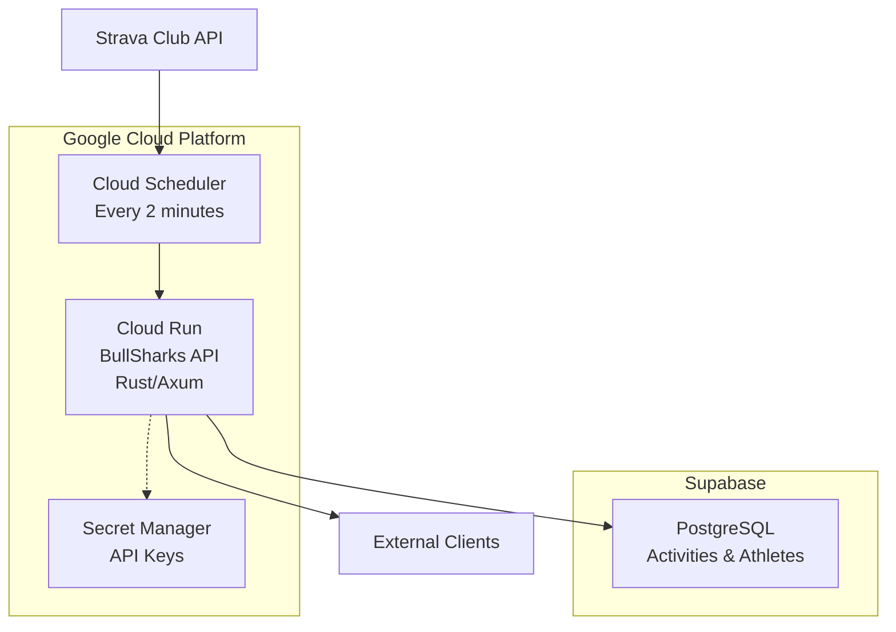
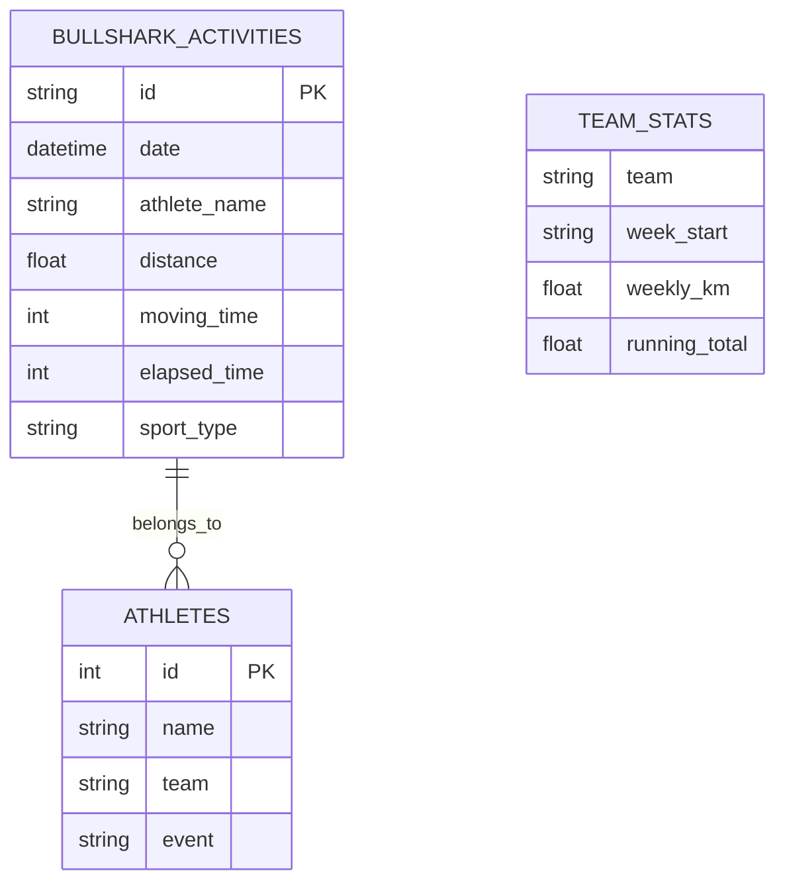

# 🏗️ System Architecture

This document provides a high-level overview of the BullSharks.online system architecture, data flow, and key design decisions.

## 🎯 System Purpose

BullSharks.online is a **Strava activity aggregation and analysis system** that serves two primary functions:

1. **Team Competition**: Bulls vs Sharks weekly running competition tracking
2. **Injury Prevention**: SSRD30 and 10% rule injury risk analysis for athletes

## 🏛️ High-Level Architecture



## 🔄 Data Flow

### 1. Activity Ingestion Flow
```
Strava Club API → Activity Sync → Database Storage → API Serving
      ↓               ↓              ↓               ↓
1. Fetch last      2. Convert     3. Store as     4. Serve via
   100 activities     to internal    BullShark       REST API
                      format         Activities
```

**Detailed Steps:**
1. **Trigger**: Cloud Scheduler calls `/populate` endpoint every 2 minutes
2. **Authentication**: Validate secret token from Google Secret Manager
3. **Data Fetch**: Retrieve last 100 activities from Strava Club API
4. **Transformation**: Convert `ClubActivity` → `BullSharkActivity` with hash-based deduplication
5. **Storage**: Insert new activities into PostgreSQL (skip duplicates)
6. **Response**: Return success/failure status

### 2. Team Statistics Flow
```
Database Activities → Weekly Aggregation → Team Competition Stats
        ↓                    ↓                      ↓
1. Filter running       2. Group by week      3. Calculate Bulls vs
   activities only         (Monday-Sunday)       Sharks totals
```

**Calculation Logic:**
- **Time Window**: December 29, 2025 → Present (hardcoded competition period)
- **Grouping**: Activities grouped by week starting Monday
- **Aggregation**: Sum distances per team per week
- **Running Totals**: Cumulative team distances over time

### 3. Injury Risk Analysis Flow
```
Athlete Activities → Risk Algorithms → Risk Classification → Weekly Grouping
        ↓                ↓                   ↓                   ↓
1. Chronological    2. SSRD30 +         3. No/Small/Moderate/   4. Group by
   ordering            10% Rule           Large Risk             week
```

**Risk Algorithms:**
- **SSRD30**: Compare each run vs max distance in prior 30 days
- **10% Rule**: Flag week-over-week volume increases >10% (>20km threshold)
- **Classification**: <10% (none), 10-30% (small), 30-100% (moderate), >100% (large)

## 🏗️ Component Architecture

### Service Layer Pattern
```
API Layer (Thin) → Service Layer (Thick) → Data Layer
      ↓                   ↓                    ↓
  HTTP Handlers    Business Logic        Database Access
  (Axum routes)   (ActivityController)    (SQLx queries)
```

**Design Principles:**
- **Thin Controllers**: API handlers focus on HTTP concerns only
- **Rich Services**: Business logic concentrated in service layer
- **Data Abstraction**: Database operations isolated in data layer

### Key Components

#### 1. API Layer (`src/api/`)
- **Purpose**: HTTP request/response handling
- **Responsibilities**: Routing, serialization, error mapping
- **Pattern**: Delegate to service layer immediately

#### 2. Service Layer (`src/services/`)
- **Purpose**: Core business logic
- **Key Service**: `ActivityController` - central orchestrator
- **Responsibilities**: 
  - Data validation and transformation
  - Business rule enforcement
  - Cross-cutting concerns (time zones, error handling)

#### 3. Data Layer (`src/models/` + `src/services/database.rs`)
- **Purpose**: Data persistence and modeling
- **Pattern**: Repository pattern with SQLx
- **Models**: Type-safe Rust structs with Serde serialization

## 🗄️ Data Architecture

### Core Entities



### Data Consistency Rules

1. **Activity Deduplication**: Hash-based on athlete name + distance + time
2. **Time Zone Handling**: Store UTC, display Pacific Time
3. **Team Assignment**: Athletes must exist in database to contribute to team stats
4. **Activity Filtering**: Only "Run" sport_type activities included in analysis

## 🔧 Infrastructure Architecture

### Deployment Model: Serverless
```
Internet → Cloud Load Balancer → Cloud Run (Auto-scaling) → Supabase PostgreSQL
                                      ↑
                              Cloud Scheduler (Cron)
```

**Benefits:**
- **Cost Effective**: Scales to zero between requests (~$1-2/month)
- **Reliable**: Managed services with built-in redundancy
- **Scalable**: Auto-scales based on traffic

### Security Model
- **API Authentication**: Public read access, secret token for writes
- **Secret Management**: Google Secret Manager for sensitive data
- **Database Security**: Connection over SSL, Supabase managed security
- **Network Security**: HTTPS only, Cloud Run built-in security

## 🕒 Time Handling Architecture

### Time Zone Strategy
```
External Input → UTC Conversion → Internal Processing → Display Conversion
     ↓                ↓                 ↓                      ↓
User timestamps   Store as UTC    Business logic      Pacific Time
                                 (timezone agnostic)   for users
```

**Key Principles:**
- **Storage**: Always UTC in database
- **Processing**: Business logic works with UTC
- **Display**: Convert to Pacific Time only at API boundaries
- **Week Calculation**: Monday = start of week (ISO standard)

## 📊 Performance Architecture

### Optimization Strategies
1. **Database Indexing**: Indexes on frequently queried fields (date, athlete_name)
2. **Query Optimization**: Efficient SQL with proper joins and filtering
3. **Minimal Data Transfer**: Only fetch required fields
4. **Serverless Benefits**: Auto-scaling, no warm-up time concerns

### Scaling Characteristics
- **Read Operations**: Scale horizontally (stateless API)
- **Write Operations**: Sequential via scheduled sync (2-minute intervals)
- **Database**: Managed scaling via Supabase
- **Bottlenecks**: Strava API rate limits (200 requests/15 minutes)

## 🔐 Error Handling Architecture

### Error Classification
```rust
pub enum ApiError {
    DatabaseError(String),           // Database connectivity/query issues
    ExternalAPIError(String),        // Strava API failures
    InternalConversionError(String), // Data transformation issues
    ValidationError(String),         // Input validation failures
    NotFoundError(String),           // Resource not found
    AuthenticationError(String),     // Authentication failures
}
```

### Error Flow Pattern
```
Error Source → Context Addition → HTTP Status Mapping → Client Response
     ↓              ↓                    ↓                   ↓
Database/API   Add operation        Map to appropriate   JSON error
failures       context             HTTP status code     response
```

## 🧪 Testing Architecture

### Testing Strategy
```
Unit Tests → Integration Tests → End-to-End Tests
     ↓              ↓                   ↓
Individual     Service layer      Full API
functions      workflows         workflows
```

**Test Organization:**
- **Location**: `src/tests/` (not inline with code)
- **Structure**: Domain-specific test modules
- **Coverage**: Comprehensive coverage of business logic
- **Example**: `injury_risk_tests.rs` with 8 comprehensive test cases

## 🔮 Extension Points

### Designed for Growth
1. **New Risk Algorithms**: Add to `analyze_injury_risks()` method
2. **Additional Sports**: Extend sport_type filtering logic  
3. **More Statistics**: Add to team stats calculations
4. **External Integrations**: New service implementations
5. **Advanced Analytics**: Additional endpoint patterns

### Architectural Constraints
- **Database Schema**: Changes require migration planning
- **API Compatibility**: Maintain backward compatibility
- **Strava Dependencies**: Limited by Strava API capabilities
- **Time Zone Assumptions**: Pacific Time hardcoded for club location

## 📈 Monitoring & Observability

### Health Monitoring
- **Health Endpoint**: `/health` checks database connectivity
- **Cloud Run Metrics**: Request volume, latency, error rates
- **Database Monitoring**: Supabase built-in monitoring
- **Scheduler Monitoring**: Cloud Scheduler execution history

### Key Metrics
- **Sync Success Rate**: Percentage of successful `/populate` calls
- **API Response Times**: P95 latency for public endpoints
- **Data Freshness**: Time since last successful activity sync
- **Error Rates**: 4xx/5xx response rates

## 🎯 Design Philosophy

### Core Principles
1. **Simplicity**: Prefer simple, understandable solutions
2. **Reliability**: Favor proven patterns over clever optimizations
3. **Maintainability**: Code should be easy to understand and modify
4. **Documentation**: Always explain the "why" behind decisions
5. **Testing**: Comprehensive test coverage for business logic
6. **Agent-Friendly**: Structure and document for AI agent collaboration

### Trade-offs Made
- **Performance vs Simplicity**: Choose simple, maintainable code over micro-optimizations
- **Features vs Reliability**: Prefer stable, well-tested features over extensive functionality
- **Cost vs Convenience**: Serverless for cost efficiency, even with cold start latency
- **Flexibility vs Convention**: Follow Rust conventions even when other approaches might work